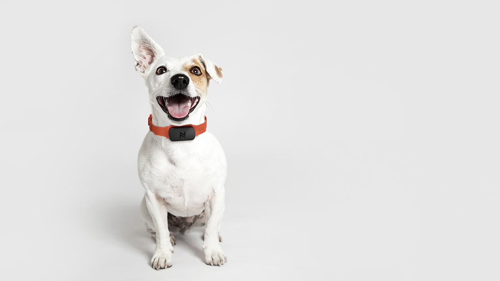

```{r setup, include=FALSE, echo=FALSE}
knitr::opts_chunk$set(echo = FALSE, warning = FALSE)

```

```{r include = FALSE}
if (!require("ipumsr")) stop("Reading IPUMS data into R requires the ipumsr package. It can be installed using the following command: install.packages('ipumsr')")
options(digits = 14)
ddi <- read_ipums_ddi("atus_00003.xml")
rectATUS <- read_ipums_micro(ddi)
```

```{r include = FALSE}
library(tidyverse)
library(ggplot2)

pet_act <- rectATUS %>% 
  filter(ACTIVITY >= 20600) %>% 
  filter(ACTIVITY <=20699) %>% 
  mutate(acttype = case_when(ACTIVITY == 20602 ~ "Care for animals and pets",
                             ACTIVITY == 20603 ~ "Walking, exercising, playing with animals", 
                             ACTIVITY == 20699 ~ "Pet and animal care, n.e.c"
                             )) %>%
  mutate(where = case_when(WHERE == 101 ~ "R's home or yard",
                           WHERE == 102 ~ "R's workplace", 
                           WHERE == 103 ~ "Someone else's home",
                           WHERE == 104 ~ "Restaurant or bar",
                           WHERE == 107 ~ "Other store/mall",
                           WHERE == 109 ~ "Outdoors--not at home",
                           WHERE == 114 ~ "Other place",
                           WHERE == 230 ~ "Driver of car, truck, or motorcycle",
                           WHERE == 232 ~ "Walking")) %>% 
  mutate(Activity = as_factor(ACTIVITY)) %>% 
  mutate(Where = as_factor(WHERE)) %>% 
  mutate(Age = as.numeric(AGE))

pet_drivers <-  pet_act %>% filter(WHERE == 230)

```

```{r include=FALSE}
#new variable: "pet_time" spent time with pets - 1, didn't spend time with pets - 0

#new dataframe categorizes rows into pet activities and nonpet activities
pet_time_var <- rectATUS %>% 
  mutate(pet_time = case_when(
    ACTIVITY >= 20600 & ACTIVITY <= 20699 ~ 1, 
    ACTIVITY <= 20600 & ACTIVITY >= 20699 ~ 0)) %>% 
  mutate(pet_time = replace_na(pet_time, 0))


#isolate CASEID's (individuals) with pet activities (1675 individuals with pets)
case_wpet <- pet_time_var %>%
  group_by(CASEID) %>%
  summarize(prop_pet_act = mean(pet_time)) %>% 
  filter(prop_pet_act != 0) 

#create vector with all individuals that involve pets
pet_case_vec <- as.vector(case_wpet$CASEID)

rectATUS1 <- rectATUS %>% 
  mutate(pet = ifelse(CASEID %in% pet_case_vec, 1, 0
  )) 

 rectATUS1 %>% 
  filter(pet == 1)#38,227 rows with pet activities


```
The American Time Use Survey
==========================================
The American Time Use Survey administered by the Bureau of Labor Statistics provides a comprehensive look into the daily activities of Americans. The survey looks at activities from time spent doing laundry, doing homework, using legal services to time spent with pets. This analysis will focus primarily on the individuals that reported time spent with pets and how they differ in terms of demographics and spending time from those who did not report spending time with pets.
```{r}

```


Demographic Insights
==========================================
```{r include= FALSE}
#frequency of respondents with pets
pet_freq <- rectATUS1 %>% group_by(pet) %>% 
  distinct(CASEID, .keep_all = TRUE) %>% 
  count()

pet_freq[2,2]/sum(pet_freq$n)
```
17.5% of all 9593 individual respondents reported spending time with pets in the . In this exploration we are assuming an individual engaging in a pet related activity indicates they are a pet owner. We also assume that individuals not reporting pet related activities are not pet owners.


```{r}
#summary statistics 
#pet_act %>% summary()
```
*Pet owners by family income*
```{r fig.width=9}
#pet owners by family income
rectATUS1 %>%
  filter(pet == 1) %>%
  ggplot(mapping = aes(x = as_factor(FAMINCOME), y = WT06)) + 
  geom_col(color = "#019587", fill = "#019587")+
  xlab("Family Income") +
  ylab("Pet Owners")
```
It appears that there are far more pet owners with higher family incomes. The income bracket with the highest population of pet owners is from $100,000 to 149,999 dollars.

*Number of pet owners by region*
```{r}
#pet owners by region
rectATUS1 %>%
  filter(pet == 1) %>%
  mutate(Region = as_factor(REGION)) %>% 
  mutate(Region = fct_reorder(Region, desc(WT06))) %>% 
  ggplot(mapping = aes(x = Region, y = WT06)) + 
  geom_bar(stat = "identity", color = "#019587", fill = "#019587") +
  xlab("Region") +
  ylab("Pet Owners")
```
The South is most heavily populated with pet owners, while the Northeast is the least.

*Pet owners by type of region*
```{r fig.width=6}
#pet owners by metropolitan 
rectATUS1 %>%
  filter(pet == 1) %>%
  ggplot(mapping = aes(x = as_factor(METRO), y = WT06)) + 
  geom_col(color = "#019587", fill = "#019587") +
  xlab("Region Type") +
  ylab("Pet Owners")
```

*Pet owners by education level*
```{r fig.width=9}
#pet owners by education
rectATUS1 %>%
  filter(pet == 1) %>%
  ggplot(mapping = aes(x = as_factor(EDUCYRS), y = WT06)) + 
  geom_col(color = "#019587", fill = "#019587")+
  xlab("Education Level") +
  ylab("Pet Owners")
```
The majority of pet owners are individuals with high school and undergraduate degrees, however this distribution is not likely to be unique to pet owners.

*Pet owners by home ownership status*
```{r}
#pet owners distribution of homeowners and renters
rectATUS1 %>%
  filter(pet == 1) %>%
  mutate(home = case_when(HHTENURE == 1 ~ "Homeowner", 
                          HHTENURE == 2 ~ "Renter",
                          HHTENURE == 3 ~ "Occupied w/o payment of cash rent")) %>% 
  ggplot(mapping = aes(x = as_factor(HHTENURE), y = WT06)) + 
  geom_col(color = "#019587", fill = "#019587")  +
  xlab("Home Ownership Status") +
  ylab("Pet Owners")
```
Most pet owners are homeowners as well. This relationship is relatively intuitive due to the limitations of owning a pet in most rental properties.

Demographics of Time Spent with Pets 
=================================================
```{r warning=FALSE}
#When are people spending time with pets?

#pet_act %>% 
  #ggplot(mapping = aes(x = SEX, y = as.POSIXct(START))) +
  #geom_col(color = "#a0e2fa", fill = "#a0e2fa") +
  #theme(plot.background = element_rect(fill = "#e8e8e8"))

#How much time on average are people spending with pets?
```
*Histogram of duration time spent with pets*
```{r}
pet_act %>% 
  ggplot(mapping = aes(DURATION)) +
  geom_histogram(color = "#019587", fill = "#019587", bins = 30) +
  theme(plot.background = element_rect(fill = "#e8e8e8"))

```

*Time with pets by day of the week*
```{r}
pet_act %>% 
  group_by(DAY) %>% 
  summarize_at(vars(DURATION), funs(weighted.mean(DURATION, WT06))) %>% 
  ggplot(mapping = aes(x = as_factor(DAY), y = DURATION)) +
  geom_col(color = "#019587", fill = "#019587") +
  ggtitle("Average Time Spent with Pet by Day") +
  xlab("Day of the week")
```

*Time with pets by Family Income*
```{r fig.width=10}
pet_act %>% 
  group_by(FAMINCOME) %>%
  summarize_at(vars(DURATION), funs(weighted.mean(DURATION, WT06))) %>% 
  ggplot(mapping = aes(x = as_factor(FAMINCOME), y = DURATION)) +
  geom_col(color = "#019587", fill = "#019587") +
  xlab("Family Income")
```
There doesn't appear to be a relationship between time spent with pets and family income.

*Time with pets by Education*
```{r fig.width=9}
pet_act %>% 
  group_by(EDUCYRS) %>%
  summarize_at(vars(DURATION), funs(weighted.mean(DURATION, WT06))) %>% 
  arrange(desc(DURATION)) %>% 
  ggplot(mapping = aes(x = as_factor(EDUCYRS), y = DURATION)) +
  geom_col(color = "#019587", fill = "#019587") 
```

*Tine with pets by Sex*
```{r}
pet_act %>% 
  group_by(SEX) %>%
  summarize_at(vars(DURATION), funs(weighted.mean(DURATION, WT06))) %>% 
  ggplot(mapping = aes(x = as_factor(SEX), y = DURATION)) +
  geom_col(color = "#019587", fill = "#019587") +
  xlab("Sex")
```
*Two Sample t-test: difference in time spent with pets across sexes?*
```{r}
time_bysex <- pet_act %>% 
  group_by(SEX) %>% 
  pivot_wider(names_from = SEX, values_from = DURATION)  %>% 
  select("1", "2")
  
t.test(time_bysex$"1", time_bysex$"2")
```
There is very strong evidence that males spent more time with pets than females (p-value: 0.000*) 95% CI:(2.14, 6.94)

*Time with pets by Age*
```{r}
pet_act %>% 
  group_by(Age) %>%
  summarize_at(vars(DURATION), funs(weighted.mean(DURATION, WT06))) %>% 
  ggplot(mapping = aes(x = Age, y = DURATION)) +
  geom_point(color = "#019587") +
  geom_smooth(method = "lm", formula = y~x)

lm(DURATION~Age, data = pet_act)

```
There is a slight relationship between age and time spent with pets. As age increases by 1 year, duration increases by 0.0374 minutes. (no test for significance)

Zooming in on Various Pet Activities
=============================================

*Comparing frequency of different pet activities using pet_act(dataset excluding non-pet activity observations)*
```{r fig.width=6}
pet_act %>% 
  ggplot(mapping = aes(Activity)) +
  geom_bar(color = "#019587", fill = "#019587") 
```
The vast majority of reported activities with pets involved care for animals and pets.

*Weighted mean duration by pet related activity*
```{r fig.width=6}

pet_act %>% 
  group_by(Activity) %>% 
  summarize_at(vars(DURATION), funs(weighted.mean(DURATION, WT06))) %>%
  ggplot(mapping = aes(x = Activity, y = DURATION)) +
  geom_col(color = "#019587", fill = "#019587")

```
The majority of time respondents spent with pets involved pet and animal care.

*Where do people spend time with pets?*

Weighted mean of duration by location of activity
```{r fig.width=10}

pet_act %>% 
  group_by(Where, Activity) %>% 
  summarize_at(vars(DURATION), funs(weighted.mean(DURATION, WT06))) %>% 
  arrange(desc(DURATION)) %>% 
  ggplot(mapping = aes(x = Where, y = DURATION)) +
  geom_col(color = "#019587", fill = "#019587", size = 1)

```
The top three locations for Americans to spend time with pets are "other place", at the store or mall, and at home.

*Weighted mean of duration by location of activity across different pet activities*
```{r fig.width=8}
pet_act %>% 
  group_by(Where, Activity) %>% 
  summarize_at(vars(DURATION), funs(weighted.mean(DURATION, WT06))) %>% 
  ggplot(mapping = aes(x = Activity, y = DURATION, fill = Where)) +
  geom_col(position = "fill")

```

What Differs between Pet Owners and others?
======================================================
*Family Income by Pet Ownership*
```{r warning = FALSE}
rectATUS1 %>% 
  distinct(CASEID, .keep_all = TRUE) %>% 
  mutate(`Pet Ownership` = case_when(pet == 1 ~ "Pet Owner",
                   pet == 0 ~ "No Pets")) %>% 
  ggplot(mapping = aes(x = `Pet Ownership`, y = as.numeric(FAMINCOME))) +
  geom_boxplot() +
  stat_summary(fun.y = "mean", geom = "point", size = 1, color = "#019587", shape = 15) +
  ylab("Family Income")
```
Pet owners appear to have a slightly higher mean and median family income than individuals with no pets.

*Education by Pet Ownership*
```{r}
rectATUS1 %>% 
  distinct(CASEID, .keep_all = TRUE) %>% 
  mutate(`Pet Ownership` = case_when(pet == 1 ~ "Pet Owner",
                   pet == 0 ~ "No Pets")) %>% 
  ggplot(mapping = aes(x = `Pet Ownership`, y = as.numeric(EDUCYRS))) +
  geom_boxplot() +
  stat_summary(fun.y = "mean", geom = "point", size = 1, color = "#019587", shape = 15) +
  ylab("Education Level")
```
There doesn't appear to be much difference in Education between pet owners and non pet owners.

Exploring connections to mental health and wellbeing
=======================================
The following comparisons may have significance in the discussion of correlation between pet ownership and mental health.

*Sleeplessness by Pet Ownership*
```{r}
#sleeplessness in pet owners vs non pet owners
rectATUS1 %>% 
  filter(ACTIVITY == 10102) %>% 
  distinct(CASEID, .keep_all = TRUE) %>% 
  mutate(`Pet Ownership` = case_when(pet == 1 ~ "Pet Owner",
                   pet == 0 ~ "No Pets")) %>% 
  ggplot(mapping = aes(x = `Pet Ownership`, y = DURATION)) +
  geom_boxplot() +
  stat_summary(fun.y = "mean", geom = "point", size = 1, color = "#019587", shape = 15)
```

*Two sample t-test comparing sleeplessness by pet ownership*
```{r}

#two sample t-test
sleeplessness <- rectATUS1 %>% 
  filter(ACTIVITY == 10102) %>% 
  group_by(pet) %>% 
  pivot_wider(names_from = pet, values_from = DURATION )  %>% 
  select("0", "1")
  
t.test(sleeplessness$"0", sleeplessness$"1")
  
```
With a p-value of 0.09, there is no evidence of a difference in time spent sleepless on average between pet owners and non pet owners at an alpha level of 0.05. 95% CI: (-1.67, 22.92)

*Histogram of time spent sleepless*
```{r }
#sleeplessness histogram
rectATUS1 %>% 
  filter(ACTIVITY == 10102) %>% 
  ggplot(mapping = aes(x = DURATION)) +
  geom_histogram(binwidth = 30, fill = "#019587")
```
The duration of time spent sleepless across respondents is heavily skewed right, suggesting we may want to transform our data for analysis.

*Log transformed historgram of time spent sleepless*
```{r}
rectATUS1 %>% 
  filter(ACTIVITY == 10102) %>% 
  ggplot(mapping = aes(x = log(DURATION))) +
  geom_histogram(bins = 30, fill = "#019587") 

```
The log transformed data appears less skewed than the original data. Lets see how this impacts our analysis.

```{r}
sleeplessness_log <- rectATUS1 %>%
  filter(ACTIVITY == 10102) %>% 
  mutate(log_duration = log(DURATION)) %>% 
  group_by(pet) %>% 
  pivot_wider(names_from = pet, values_from = log_duration )  %>% 
  select("0", "1")
t.test(sleeplessness_log$`0`, sleeplessness_log$`1`)
```
The new t-test with log transformed data yields the same results: there is no evidence of a difference in time spent sleepless across pet ownership.


*Time Spent Outdoors by Pet Ownership*
```{r}
#Time spent outdoors: pet owners vs non pet owners
rectATUS1 %>% 
  filter(WHERE == 109) %>% 
  mutate(`Pet Ownership` = case_when(pet == 1 ~ "Pet Owner",
                   pet == 0 ~ "No Pets")) %>% 
  ggplot(mapping = aes(x = `Pet Ownership`, y = log(DURATION))) +
  geom_boxplot() +
  stat_summary(fun.y = "mean", geom = "point", size = 1, color = "#019587", shape = 15)
```

```{r}
#two sample t-test
time_outdoors <- rectATUS1 %>% 
  filter(WHERE == 109) %>% 
  group_by(pet) %>% 
  pivot_wider(names_from = pet, values_from = DURATION )  %>% 
  select("0", "1")
  
t.test(time_outdoors$"0", time_outdoors$"1")
```
There is very strong evidence of a difference in time spent outdoors between pet owners and non pet owners (p-value= 0.000*). We can be 95% confident that people without pets spend between 18.13 and 29.70 more minutes outside than their pet owning counterparts.

*Histogram of time spent outdoors*
```{r}
rectATUS1 %>% 
  filter(WHERE == 109) %>% 
  ggplot(mapping = aes(x = DURATION)) +
  geom_histogram(binwidth = 30, fill = "#019587")
```
Once again, our data is skewed right.

*Log transformed histogram of time spent outdoors*
```{r}
rectATUS1 %>% 
  filter(WHERE == 109) %>% 
  ggplot(mapping = aes(x = log(DURATION))) +
  geom_histogram(bins = 30, fill = "#019587")
```
Taking the log of duration of time spent outdoors slightly normalizes the distribution. Let's take a look at how this transformation affects the two sample t-test...

```{r}
#two sample t-test
time_outdoors <- rectATUS1 %>%
  filter(WHERE == 109) %>% 
  mutate(log_duration = log(DURATION)) %>% 
  group_by(pet) %>% 
  pivot_wider(names_from = pet, values_from = log_duration )  %>% 
  select("0", "1")
  
t.test(time_outdoors$"0", time_outdoors$"1")
```
With the log transformed data, the t-test provides the same results. There is very strong evidence that non pet owners spend more time outside than pet owners (p-value = 0.000*)

*Leisure across pet ownership*
```{r}
#Leisure among pet vs. non pet owners
rectATUS1 %>% 
  filter(ACTIVITY == c(120000:120299)) %>% 
  mutate(`Pet Ownership` = case_when(pet == 1 ~ "Pet Owner",
                   pet == 0 ~ "No Pets")) %>% 
  ggplot(mapping = aes(x = `Pet Ownership`, y = DURATION)) +
  geom_boxplot() +
  stat_summary(fun.y = "mean", geom = "point", size = 1, color = "019587", shape = 15)
```
Unfortunately, there is only one data point describing leisure for a respondent that also reported spending time with pets.

```{r}
#Sports, Exercise and Recreation: pet vs no pets
rectATUS1 %>% 
  filter(ACTIVITY == c(130000:130199)) %>% 
  mutate(`Pet Ownership` = case_when(pet == 1 ~ "Pet Owner",
                   pet == 0 ~ "No Pets")) %>% 
  ggplot(mapping = aes(x = `Pet Ownership`, y = DURATION)) +
  geom_boxplot() +
  stat_summary(fun.y = "mean", geom = "point", size = 1, color = "#019587", shape = 15) +
  ggtitle("Sports, Exercise and Recreation: pets vs no pets")
#only one pet observation
```
Unfortunately, there are only two data points describing leisure for a respondent that also reported spending time with pets.

```{r}
act_quant <- rectATUS1 %>% 
  group_by(pet) %>%
  count(CASEID) %>% 
  mutate(`Pet Ownership` = case_when(pet == 1 ~ "Pet Owner",
                   pet == 0 ~ "No Pets"))
```

*How many activities do pet owners and non pet owners engage in per day?*
```{r}

act_quant %>% 
  ggplot(mapping = aes(x = `Pet Ownership`, y = n)) +
  geom_boxplot() +
  stat_summary(fun.y = "mean", geom = "point", size = 1, color = "#019587", shape = 15) +
  ggtitle("Number of activities by Pet Ownership")
```
It appears as though pet owners engage in more activities than non pet owners on a daily basis. Lets see if there is a significant difference using a t-test...

```{r}
#two sample t-test
act_quant_ttest <- act_quant %>% 
  group_by(pet) %>% 
  pivot_wider(names_from = pet, values_from = n )  %>% 
  select("0", "1")
  
t.test(act_quant_ttest$"0", act_quant_ttest$"1")
  
```
There is very strong evidence that pet owners engage in more activities than non pet owners on average (p-value = 0.000*). 95% CI: (-4.82, -3.97)

```{r}
#time spent sleeping: pet owners vs. non pet owners
rectATUS1 %>% 
  filter(ACTIVITY %in% c(10100, 10101, 10199)) %>% 
  distinct(CASEID, .keep_all = TRUE) %>% 
  mutate(`Pet Ownership` = case_when(pet == 1 ~ "Pet Owner",
                   pet == 0 ~ "No Pets")) %>% 
  ggplot(mapping = aes(x = `Pet Ownership`, y = DURATION)) +
  geom_boxplot() +
  stat_summary(fun.y = "mean", geom = "point", size = 1, color = "#019587", shape = 15)
```

```{r}
time_sleeping <- rectATUS1 %>%
  filter(ACTIVITY %in% c(10100, 10101, 10199)) %>% 
  group_by(pet) %>% 
  pivot_wider(names_from = pet, values_from = DURATION)  %>% 
  select("0", "1")
  
t.test(time_sleeping$"0", time_sleeping$"1")
```

```{r}
rectATUS1 %>% 
  filter(ACTIVITY %in% c(10100, 10101, 10199)) %>% 
  ggplot(mapping = aes(x = log(DURATION))) +
  geom_histogram()
```

